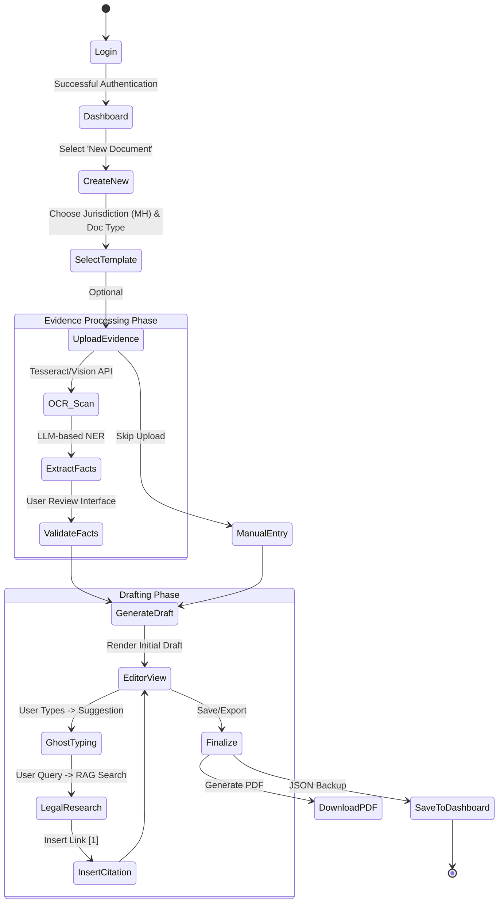
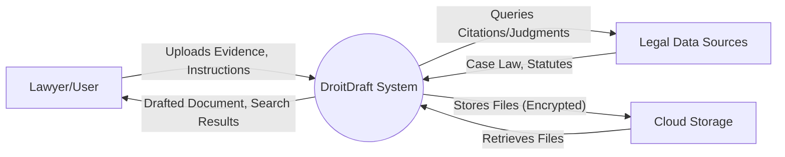
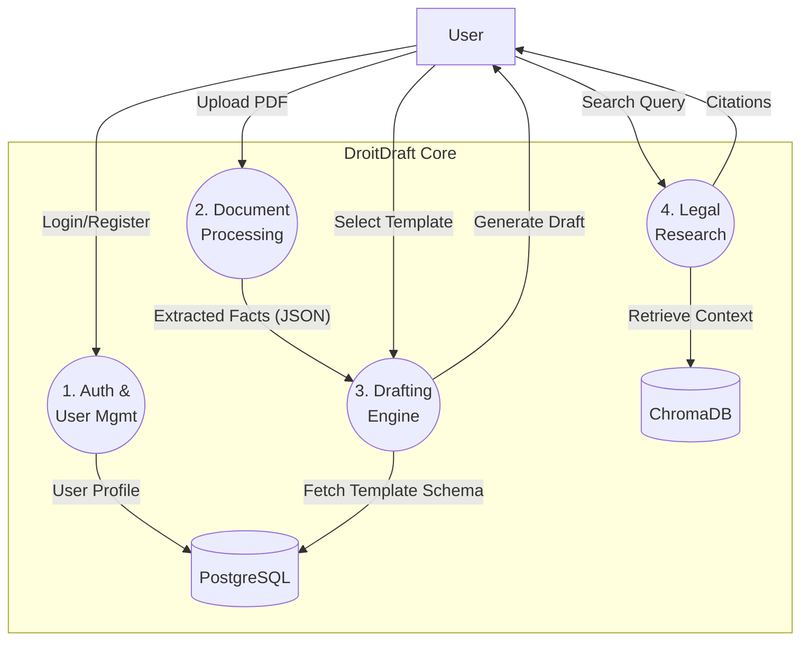
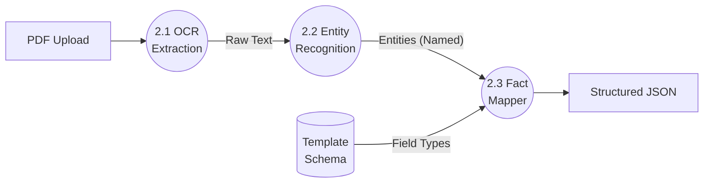
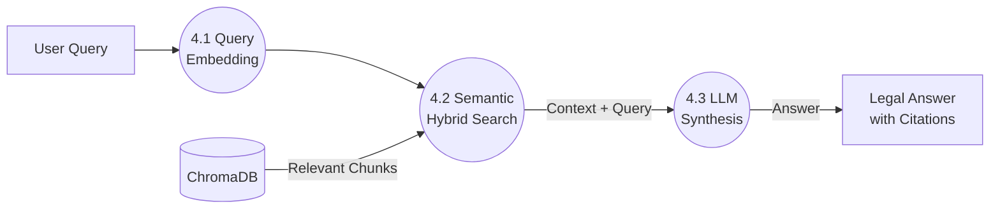
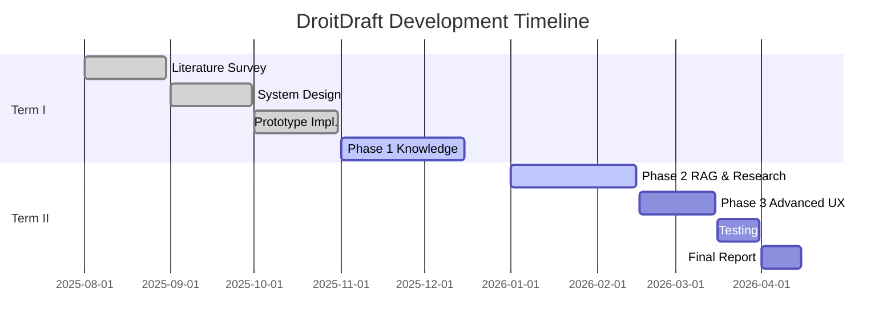

# 4. Analysis Modeling

## 4.1 Activity Diagram

The following Activity Diagram illustrates the detailed workflow of a user creating a legal draft using DroitDraft.

## 4.2 Functional Modeling (Data Flow Diagrams)

### 4.2.1 DFD Level 0 (Context Diagram)

The Level 0 DFD depicts the entire DroitDraft system as a single black-box process interacting with external entities.

*   **Inputs**: User uploads PDF Evidence, Instructions; Admin updates Rules.
*   **Outputs**: Drafted Documents, Search Results, Logs.
*   **External Entities**: 
    *   **User**: Providing instructions.
    *   **Legal Sources**: Indian Kanoon (Case Law), LiveLaw (Updates).
    *   **Cloud Storage**: Storing evidence files.

### 4.2.2 DFD Level 1 (High-Level Subsystems)

This diagram decomposition breaks the system into four major subsystems:

1.  **Auth & User Mgmt**: Handles JWT tokens, role-based access.
2.  **Document Processing**: OCR, Cleaning, Fact Extraction pipeline.
3.  **Drafting Engine**: Template mapping, Variable substitution, Ghost Typing inference.
4.  **Legal Research (RAG)**: Vector embedding, Semantic search, Citation retrieval.

### 4.2.3 DFD Level 2 (Detailed Process Breakdown)

#### Process 2: Document Processing Pipeline
Input: Raw PDF -> Output: Structured JSON.

#### Process 4: Legal Research (RAG) Pipeline
Input: Query -> Output: Answer with Citations.

## 4.3 Timeline Chart

The project development is divided into two academic terms involving distinct phases of research, prototype development, and advanced feature integration.

### Term I: Research & Core Development

| Phase | Duration | Key Milestones | Status |
| :--- | :--- | :--- | :--- |
| **Literature Survey & Prob. Def.** | Aug 1 - Aug 30 | Problem Statement, Scope, Lit. Review | Completed |
| **System Analysis & Design** | Sep 1 - Sep 30 | SRS, UML Diagrams, Tech Stack Selection | Completed |
| **Prototype Implementation** | Oct 1 - Oct 31 | Basic UI, Auth, Database Setup | Completed |
| **Phase 1: Knowledge Base** | Nov 1 - Dec 15 | Template Library, Basic OCR | Completed |

### Term II: Advanced Features & Deployment

| Phase | Duration | Key Milestones | Status |
| :--- | :--- | :--- | :--- |
| **Phase 2: RAG & Research** | Jan 1 - Feb 15 | ChromaDB Integration, Legal Research Agent | **In Progress** |
| **Phase 3: Advanced UX** | Feb 16 - Mar 15 | Ghost Typing, Interactive Sidebar | Planned |
| **Testing & Optimization** | Mar 16 - Mar 31 | Unit Tests, Load Testing, Bug Fixes | Planned |
| **Final Documentation & Report** | Apr 1 - Apr 15 | Final Report, User Manual, Presentation | Planned |

