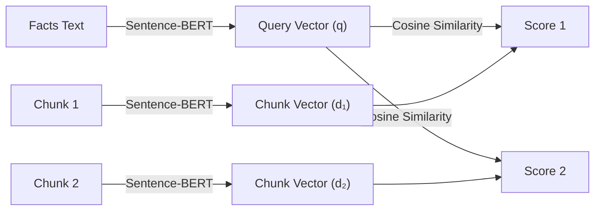
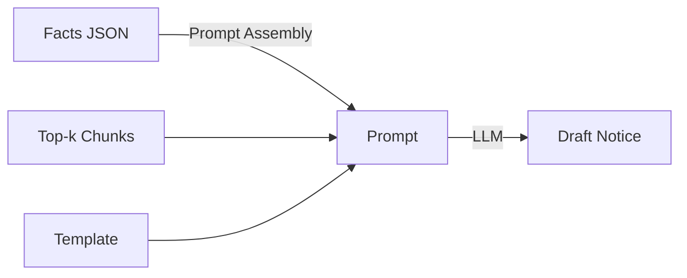

# 6. Implementation

## 6.1 Algorithms/Methods Used

The DroitDraft system leverages a combination of deterministic algorithms (for retrieval) and probabilistic methods (for generation) to solve the legal drafting challenge.

### 6.1.1 Retrieval-Augmented Generation (RAG)
We implemented a standard RAG pipeline to ground the AI's generation in verified legal data, preventing hallucinations.

*   **Chunking Methodology**: *Simple Word-based Splitting*
    *   **Algorithm**: Documents are split into chunks of **512 words** with a **50-word overlap**.
    *   **Rationale**: Legal statutes often have cross-references. Overlap ensures that a sentence split across chunks doesn't lose context.
*   **Embedding Methodology**: *Dense Vector Mapping*
    *   **Model**: We use **Sentence-BERT (all-MiniLM-L6-v2)** to map legal text to a **384-dimensional dense vector space**.
    *   **Similarity Metric**: We use **Cosine Similarity** to calculate the angle between the Query Vector and Document Vectors. The chunks with the highest cosine similarity score (closest to 1.0) are retrieved as relevant context.

### 6.1.2 Hybrid Search (Implemented)
*Note: The current implementation uses an integrated hybrid search strategy combining dense and sparse retrieval.*

- **Dense Retrieval**: Uses Vector Similarity (captures semantic meaning like "bounced check"). *(Implemented)*
- **Sparse Retrieval**: Uses **BM25 (Best Matching 25)** algorithm via the `EnsembleRetriever` to capture exact keywords like "NI Act". *(Implemented)*
- **Fusion Algorithm**: **Reciprocal Rank Fusion (RRF)**. Ranks from both methods are merged based on the `HYBRID_SEARCH_CONFIG` (Keyword weight: 0.6, Semantic weight: 0.4). *(Implemented)*

### 6.1.3 Fact Extraction (NER via Generative AI)
Instead of traditional CRF-based Named Entity Recognition (like Spacy), we use **Generative Extraction**.

*   **Method**: We pass the OCR text to Llama 3 with a strict **Pydantic/JSON Schema** definition.
*   **Prompting Strategy**: **One-Shot Prompting**. We provide *one* example of a correct extraction in the system prompt to guide the model's output format, ensuring the JSON structure is always valid.

### 6.1.4 Ghost Typing (Predictive Text)
*   **Method**: **Causal Language Modeling (Next Token Prediction)**. The model predicts the most probable next sequence of tokens based on the current cursor position.
*   **Optimization Algorithm**: **Debouncing**. To prevent server overload and UI jitter, the API request is only triggered after the user stops typing for **1000ms**. If the user types again within this window, the previous request is cancelled.

## 6.2 Algorithm Walkthrough on One Example Query (Single Slide Narrative)

Goal: Show, step-by-step, how a user query is transformed at every stage of the DroitDraft pipeline, with concrete intermediate values and outputs.

**Example Query:**

> "Draft a legal notice under Section 138 NI Act for cheque bounce. Cheque amount is ₹2,50,000, cheque date is 05 Jan 2025, return memo reason is 'insufficient funds'."

---


### Step 1: Fact Extraction (Generative Extraction + One-Shot Prompting)

**Input:**
```
Draft a legal notice under Section 138 NI Act for cheque bounce. Cheque amount is ₹2,50,000, cheque date is 05 Jan 2025, return memo reason is 'insufficient funds'.
```

**Transformation:**
The query is passed to Llama 3.3 with a one-shot prompt and a strict JSON schema.

**Diagram:**


**Output (Extracted Facts JSON):**
```json
{
    "statute": "Section 138 NI Act",
    "amount": 250000,
    "cheque_date": "2025-01-05",
    "dishonour_reason": "insufficient funds",
    "task": "draft_legal_notice"
}
```

---


### Step 2: Passage Chunking (Word-Based Splitting)

**Input:**
Relevant legal text (e.g., Section 138 NI Act):
```
Section 138. Dishonour of cheque for insufficiency, etc., of funds in the account... payee may make a demand for the payment... within 15 days of receiving information... etc.
```

**Transformation:**
Split into overlapping word-based chunks (Width=512 words, overlap=50 words):

**Logic:**
For a text with $W$ total words:
$$
\text{Chunk}_n = \text{words}[n \cdot (512 - 50) : n \cdot (512 - 50) + 512]
$$

**Output (Chunks):**
```
Chunk 1: "Section 138. Dishonour of cheque for insufficiency... [first 512 words]"
Chunk 2: "[words 462 to 974] ...may make a demand for the payment... within 15 days... [next 512 words]"
```

---


### Step 3: Dense Vectorization & Retrieval (Sentence-BERT)

**Input:**
- Query facts text: "Section 138 cheque bounce insufficient funds"
- Chunks from Step 2

**Transformation:**
Encode both query and chunks into 384-dimensional vectors using Sentence-BERT, then compute cosine similarity between the query vector and each chunk vector. The top-k chunks with the highest similarity are retrieved as context.

**Example (actual values):**
- Query facts text: "Section 138 cheque bounce insufficient funds"
- Chunk 1 vector: `[0.12, 0.03, ..., 0.09]` (384-dim)
- Chunk 2 vector: `[0.11, 0.02, ..., 0.08]` (384-dim)
- Query vector: `[0.13, 0.04, ..., 0.10]` (384-dim)

Cosine similarity calculation (for illustration):
$$
\cos(\theta) = \frac{q \cdot d}{\|q\|\|d\|}
$$
For the example vectors, suppose:
$$
\cos(q, d_1) = 0.82 \\
\cos(q, d_2) = 0.77
$$
So, Chunk 1 is ranked higher.

**Diagram:**


**Output (Sample Scores):**
```
cos_sim(q, d₁) = 0.82
cos_sim(q, d₂) = 0.77
```
**Dense Ranked List:**
1. Chunk 1 (0.82)
2. Chunk 2 (0.77)

---


### Step 4: Prompt Assembly & Draft Generation (RAG)

**Input:**
- Extracted Facts JSON
- Top-k retrieved context chunks
- Legal Template (Structural Blueprint)

**Transformation:**
Prompt template is filled:
```
INSTRUCTIONS: Draft a legal notice...
**Case Facts & Data Points:**
{Facts JSON}
**Source Evidence (Grounded Information):**
{Top-k Chunks}
**Legal Template (Structural Blueprint):**
{Template}
```
Passed to LLM for generation.

**Diagram:**


**Output (Draft Excerpt):**
```
Legal Notice (Civil/Property)
Drafting Date: March 11, 2026

LEGAL NOTICE

To,
{{ recipient_name }}
{{ recipient_address }}

Subject: Notice under Section 138 of the Negotiable Instruments Act, 1881 for Dishonour of Cheque

Dear Sir/Madam,

Under instructions from my client, {{ client_name }}, residing at {{ client_address }}, I hereby serve you with the following legal notice:

1. My client is the owner/aggrieved party in the matter of a cheque dated 05 Jan 2025, bearing the amount of ₹2,50,000, which was dishonoured due to insufficient funds.
2. FACTUAL BACKGROUND: On 05 Jan 2025, you issued a cheque in favour of my client for ₹2,50,000. However, when the cheque was presented for payment, it was returned with a memo stating 'insufficient funds' as the reason for dishonour, thereby attracting the provisions of Section 138 of the Negotiable Instruments Act, 1881.
3. GRIEVANCE: That you have failed to make good the payment of ₹2,50,000, despite the cheque being dishonoured, which constitutes an offence under Section 138 of the Negotiable Instruments Act, 1881.
4. DEMAND: You are hereby called upon to pay the said amount of ₹2,50,000, along with interest and costs, within 15 days from the receipt of this notice, as mandated by the provisions of Section 138 of the Negotiable Instruments Act, 1881, read with Section 142 of the Negotiable Instruments Act, 1881.
5. CAUSE OF ACTION: Failing which, my client has given me clear instructions to initiate civil and criminal proceedings against you, pursuant to Section 138 of the Negotiable Instruments Act, 1881, and Section 420 of the Indian Penal Code, 1860, at your cost and consequences.

Yours faithfully,

{{ lawyer_name }}
Advocate, Mumbai
```

---


### Step 8 (Optional): Editor Suggestion (Ghost Typing)

**Input:**
Partial draft: "You are hereby called upon to pay..."

**Transformation:**
After 1000ms pause, next-token prediction is triggered.

**Equation:**
$$
P(x_t \mid x_{1:t-1}) = \mathrm{softmax}(z_t)
$$

**Diagram:**


**Output:**
Suggestion: "within 15 days of receipt of this notice."

**Example (actual values):**
- Partial draft: "You are hereby called upon to pay..."
- After 1000ms pause, model suggests: "within 15 days of receipt of this notice."

---

**Summary Table: Example Query Transformation**

| Step | Input | Output |
|------|-------|--------|
| 1 | User query | Facts JSON |
| 2 | Legal text | Chunks |
| 3 | Facts, Chunks | Dense ranking |
| 4 | Facts, Context | Draft |
| 5 | Partial draft | Suggestion |

