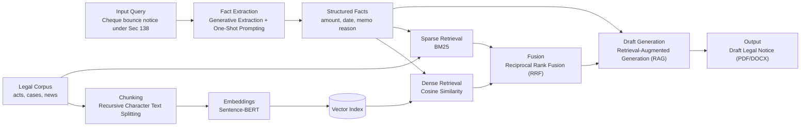

# 6. Implementation

## 6.1 Algorithms/Methods Used

The DroitDraft system leverages a combination of deterministic algorithms (for retrieval) and probabilistic methods (for generation) to solve the legal drafting challenge.

### 6.1.1 Retrieval-Augmented Generation (RAG)
We implemented a standard RAG pipeline to ground the AI's generation in verified legal data, preventing hallucinations.

*   **Chunking Methodology**: *Recursive Character Text Splitting*
    *   **Algorithm**: Documents are split into chunks of **1000 characters** with a **200-character overlap**.
    *   **Rationale**: Legal statutes often have cross-references. Overlap ensures that a sentence split across chunks doesn't lose context.
*   **Embedding Methodology**: *Dense Vector Mapping*
    *   **Model**: We use **Sentence-BERT (all-MiniLM-L6-v2)** to map legal text to a **384-dimensional dense vector space**.
    *   **Similarity Metric**: We use **Cosine Similarity** to calculate the angle between the Query Vector and Document Vectors. The chunks with the highest cosine similarity score (closest to 1.0) are retrieved as relevant context.

### 6.1.2 Hybrid Search (Keyword + Semantic)
To improve retrieval accuracy for specific legal terms (e.g., "Section 138"), we implement a Hybrid Search strategy.

*   **Dense Retrieval**: Uses Vector Similarity (captures semantic meaning like "bounced check").
*   **Sparse Retrieval**: Uses **BM25 (Best Matching 25)** algorithm (captures exact keywords like "NI Act").
*   **Fusion Algorithm**: **Reciprocal Rank Fusion (RRF)**. We rank the results from both methods and merge them based on the formula:
    $$ RRF(d) = \sum_{r \in R} \frac{1}{k + r(d)} $$
    where $r(d)$ is the rank of document $d$ in the retrieved list $R$, and $k$ is a constant (typically 60).

### 6.1.3 Fact Extraction (NER via Generative AI)
Instead of traditional CRF-based Named Entity Recognition (like Spacy), we use **Generative Extraction**.

*   **Method**: We pass the OCR text to Llama 3 with a strict **Pydantic/JSON Schema** definition.
*   **Prompting Strategy**: **One-Shot Prompting**. We provide *one* example of a correct extraction in the system prompt to guide the model's output format, ensuring the JSON structure is always valid.

### 6.1.4 Ghost Typing (Predictive Text)
*   **Method**: **Causal Language Modeling (Next Token Prediction)**. The model predicts the most probable next sequence of tokens based on the current cursor position.
*   **Optimization Algorithm**: **Debouncing**. To prevent server overload and UI jitter, the API request is only triggered after the user stops typing for **300ms**. If the user types again within this window, the previous request is cancelled.

## 6.2 Algorithm Walkthrough (PPT Slide Ready)

This section can be copied directly into your project PPT to explain how one legal query is processed end-to-end.

### 6.2.1 Example Input Query

> "Draft a legal notice under Section 138 NI Act for cheque bounce. Cheque amount is ₹2,50,000, cheque date is 05 Jan 2025, return memo reason is 'insufficient funds'."

### 6.2.2 Processing Steps and Algorithms

1. **Input understanding + fact structuring**
   - The user query and any uploaded document text are processed with **Generative Extraction** using **One-Shot Prompting**.
   - Output is a structured facts object (party name, amount, cheque date, dishonour reason, notice context).

2. **Knowledge base preparation (offline/ingestion path)**
   - Legal corpus is chunked via **Recursive Character Text Splitting**.
   - Chunks are encoded via **Sentence-BERT (all-MiniLM-L6-v2)** embeddings and stored for retrieval.

3. **Hybrid legal retrieval for the current query**
   - Dense semantic retrieval uses **Cosine Similarity** over embeddings.
   - Sparse lexical retrieval uses **BM25**.
   - Results are merged with **Reciprocal Rank Fusion (RRF)** to produce a ranked legal context.

4. **Grounded draft generation**
   - The structured facts + ranked legal context are passed to **Retrieval-Augmented Generation (RAG)**.
   - The model generates draft legal notice sections (facts, legal grounds, demand clause, timeline).

5. **Editor-time refinement (optional)**
   - While the lawyer edits, **Causal Language Modeling** provides next-token suggestions.
   - **Debouncing** controls request frequency to keep typing smooth and stable.

### 6.2.3 Slide Diagram (Mermaid)

### 6.2.4 Example Output (What the model returns)

- Notice heading and party details.
- Factual chronology of cheque issuance and dishonour.
- Legal basis under Section 138 NI Act with supporting context.
- Demand paragraph and payment deadline language.
