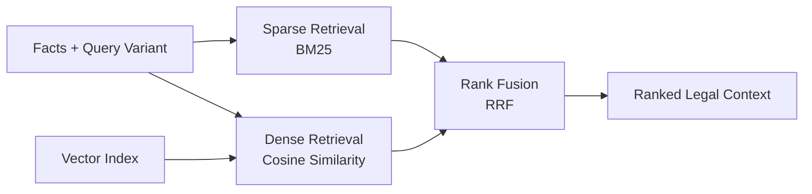
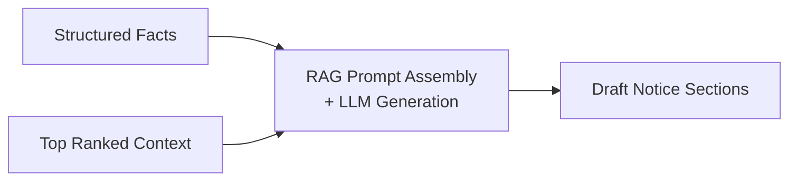

# 6. Implementation

## 6.1 Algorithms/Methods Used

The DroitDraft system leverages a combination of deterministic algorithms (for retrieval) and probabilistic methods (for generation) to solve the legal drafting challenge.

### 6.1.1 Retrieval-Augmented Generation (RAG)
We implemented a standard RAG pipeline to ground the AI's generation in verified legal data, preventing hallucinations.

*   **Chunking Methodology**: *Recursive Character Text Splitting*
    *   **Algorithm**: Documents are split into chunks of **1000 characters** with a **200-character overlap**.
    *   **Rationale**: Legal statutes often have cross-references. Overlap ensures that a sentence split across chunks doesn't lose context.
*   **Embedding Methodology**: *Dense Vector Mapping*
    *   **Model**: We use **Sentence-BERT (all-MiniLM-L6-v2)** to map legal text to a **384-dimensional dense vector space**.
    *   **Similarity Metric**: We use **Cosine Similarity** to calculate the angle between the Query Vector and Document Vectors. The chunks with the highest cosine similarity score (closest to 1.0) are retrieved as relevant context.

### 6.1.2 Hybrid Search (Keyword + Semantic)
To improve retrieval accuracy for specific legal terms (e.g., "Section 138"), we implement a Hybrid Search strategy.

*   **Dense Retrieval**: Uses Vector Similarity (captures semantic meaning like "bounced check").
*   **Sparse Retrieval**: Uses **BM25 (Best Matching 25)** algorithm (captures exact keywords like "NI Act").
*   **Fusion Algorithm**: **Reciprocal Rank Fusion (RRF)**. We rank the results from both methods and merge them based on the formula:
    $$ RRF(d) = \sum_{r \in R} \frac{1}{k + r(d)} $$
    where $r(d)$ is the rank of document $d$ in the retrieved list $R$, and $k$ is a constant (typically 60).

### 6.1.3 Fact Extraction (NER via Generative AI)
Instead of traditional CRF-based Named Entity Recognition (like Spacy), we use **Generative Extraction**.

*   **Method**: We pass the OCR text to Llama 3 with a strict **Pydantic/JSON Schema** definition.
*   **Prompting Strategy**: **One-Shot Prompting**. We provide *one* example of a correct extraction in the system prompt to guide the model's output format, ensuring the JSON structure is always valid.

### 6.1.4 Ghost Typing (Predictive Text)
*   **Method**: **Causal Language Modeling (Next Token Prediction)**. The model predicts the most probable next sequence of tokens based on the current cursor position.
*   **Optimization Algorithm**: **Debouncing**. To prevent server overload and UI jitter, the API request is only triggered after the user stops typing for **300ms**. If the user types again within this window, the previous request is cancelled.

## 6.2 Algorithm Walkthrough (PPT Slide Ready)

This version is intentionally deeper and can be split across multiple slides. We use one concrete cheque-bounce query and show exactly how each algorithm transforms data in this project.

### 6.2.1 Example Query + Extracted Facts (Step 1)

**Input query**

> "Draft a legal notice under Section 138 NI Act for cheque bounce. Cheque amount is ₹2,50,000, cheque date is 05 Jan 2025, return memo reason is 'insufficient funds'."

**How algorithm works here**

- We run **Generative Extraction** with **One-Shot Prompting** against the query and OCR text.
- The one-shot example constrains output into a strict JSON schema (fielded facts, not free text).
- This reduces downstream ambiguity by converting natural language into canonical keys.

**Example structured output (simplified)**

```json
{
  "statute": "Section 138 NI Act",
  "amount": 250000,
  "cheque_date": "2025-01-05",
  "dishonour_reason": "insufficient funds",
  "task": "draft_legal_notice"
}
```


### 6.2.2 Corpus Preparation for Retrieval (Step 2)

**How algorithm works here**

- Legal source text (acts/case snippets/news) is split using **Recursive Character Text Splitting** (1000 chars, 200 overlap).
- Overlap preserves context where legal meaning crosses chunk boundaries.
- Each chunk is converted to a dense vector using **Sentence-BERT (all-MiniLM-L6-v2)**.

**Concrete effect for this query**

- Terms like "Section 138", "dishonour", "notice" may appear across adjacent chunks.
- Overlap improves recall so relevant parts are not lost at split boundaries.


### 6.2.3 Hybrid Retrieval + Fusion on the Example Query (Step 3)

**How algorithm works here**

- From structured facts, we form retrieval query variants.
- **BM25** prioritizes lexical/legal-token matches (e.g., "Section 138", "NI Act").
- **Cosine Similarity** over embeddings captures semantic intent (e.g., "cheque bounce" ≈ "dishonoured cheque").
- **Reciprocal Rank Fusion (RRF)** merges both ranked lists, so documents strong in either channel surface higher.

**Mini worked ranking example**

- BM25 top-3: `D2, D5, D1`
- Dense top-3: `D5, D3, D2`
- After RRF: `D5` (strong in both) > `D2` > `D3` > `D1`



### 6.2.4 Grounded Draft Generation (Step 4)

**How algorithm works here**

- **RAG** composes prompt = (structured facts + top retrieved context + drafting instructions).
- The model is forced to draft using retrieved legal context, reducing unsupported claims.
- Output is emitted as section-wise draft text for notice formatting.

**Typical section outputs**

- Party/transaction facts
- Cheque dishonour chronology
- Section 138 legal basis
- Demand + payment timeline



### 6.2.5 Optional Editor-Time Assistance (Step 5)

- During manual editing, **Causal Language Modeling** predicts continuation text.
- **Debouncing (300ms)** avoids firing API calls on every keystroke.


