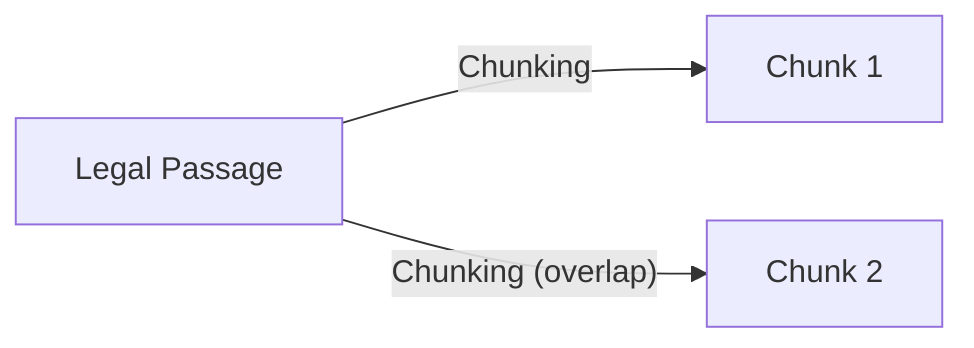
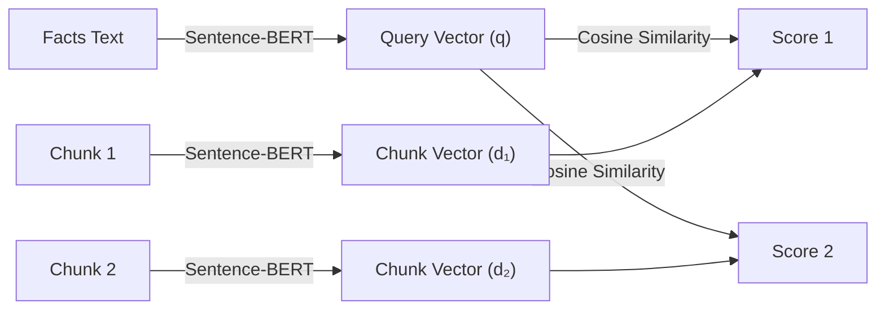
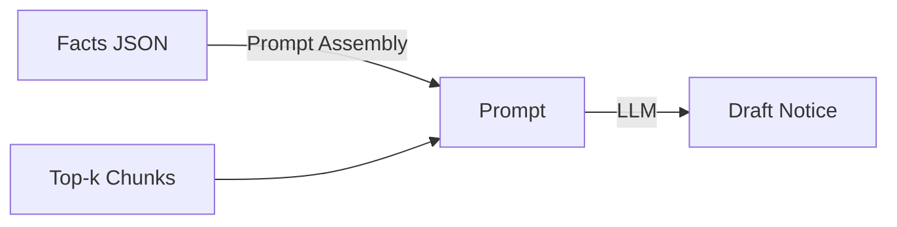

# 6. Implementation

## 6.1 Algorithms/Methods Used

The DroitDraft system leverages a combination of deterministic algorithms (for retrieval) and probabilistic methods (for generation) to solve the legal drafting challenge.

### 6.1.1 Retrieval-Augmented Generation (RAG)
We implemented a standard RAG pipeline to ground the AI's generation in verified legal data, preventing hallucinations.

*   **Chunking Methodology**: *Recursive Character Text Splitting*
    *   **Algorithm**: Documents are split into chunks of **1000 characters** with a **200-character overlap**.
    *   **Rationale**: Legal statutes often have cross-references. Overlap ensures that a sentence split across chunks doesn't lose context.
*   **Embedding Methodology**: *Dense Vector Mapping*
    *   **Model**: We use **Sentence-BERT (all-MiniLM-L6-v2)** to map legal text to a **384-dimensional dense vector space**.
    *   **Similarity Metric**: We use **Cosine Similarity** to calculate the angle between the Query Vector and Document Vectors. The chunks with the highest cosine similarity score (closest to 1.0) are retrieved as relevant context.

### 6.1.2 Hybrid Search (Planned/Future Work)
*Note: The current implementation uses only dense retrieval (Sentence-BERT + cosine similarity). Hybrid search, BM25, and Reciprocal Rank Fusion (RRF) are not yet implemented in the pipeline. The following is a conceptual description for future development:*

- **Dense Retrieval**: Uses Vector Similarity (captures semantic meaning like "bounced check"). *(Implemented)*
- **Sparse Retrieval**: Uses **BM25 (Best Matching 25)** algorithm (captures exact keywords like "NI Act"). *(Planned)*
- **Fusion Algorithm**: **Reciprocal Rank Fusion (RRF)**. Ranks from both methods are merged using:
    $$ RRF(d) = \sum_{r \in R} \frac{1}{k + r(d)} $$
    where $r(d)$ is the rank of document $d$ in the retrieved list $R$, and $k$ is a constant (typically 60). *(Planned)*

### 6.1.3 Fact Extraction (NER via Generative AI)
Instead of traditional CRF-based Named Entity Recognition (like Spacy), we use **Generative Extraction**.

*   **Method**: We pass the OCR text to Llama 3 with a strict **Pydantic/JSON Schema** definition.
*   **Prompting Strategy**: **One-Shot Prompting**. We provide *one* example of a correct extraction in the system prompt to guide the model's output format, ensuring the JSON structure is always valid.

### 6.1.4 Ghost Typing (Predictive Text)
*   **Method**: **Causal Language Modeling (Next Token Prediction)**. The model predicts the most probable next sequence of tokens based on the current cursor position.
*   **Optimization Algorithm**: **Debouncing**. To prevent server overload and UI jitter, the API request is only triggered after the user stops typing for **300ms**. If the user types again within this window, the previous request is cancelled.

## 6.2 Algorithm Walkthrough on One Example Query (Single Slide Narrative)

Goal: Show, step-by-step, how a user query is transformed at every stage of the DroitDraft pipeline, with concrete intermediate values and outputs.

**Example Query:**

> "Draft a legal notice under Section 138 NI Act for cheque bounce. Cheque amount is ₹2,50,000, cheque date is 05 Jan 2025, return memo reason is 'insufficient funds'."

---


### Step 1: Fact Extraction (Generative Extraction + One-Shot Prompting)

**Input:**
```
Draft a legal notice under Section 138 NI Act for cheque bounce. Cheque amount is ₹2,50,000, cheque date is 05 Jan 2025, return memo reason is 'insufficient funds'.
```

**Transformation:**
The query is passed to Llama 3 with a one-shot prompt and a strict JSON schema.

**Diagram:**


**Output (Extracted Facts JSON):**
```json
{
    "statute": "Section 138 NI Act",
    "amount": 250000,
    "cheque_date": "2025-01-05",
    "dishonour_reason": "insufficient funds",
    "task": "draft_legal_notice"
}
```

---


### Step 2: Passage Chunking (Recursive Character Text Splitting)

**Input:**
Relevant legal text (e.g., Section 138 NI Act):
```
Section 138. Dishonour of cheque for insufficiency, etc., of funds in the account... payee may make a demand for the payment... within 15 days of receiving information... etc.
```

**Transformation:**
Split into overlapping chunks (L=1000, overlap=200):

**Equation:**
$$
s_i = i \cdot (L - o),\; L=1000,\; o=200
$$
For the example query, the first two chunk start indices are:
$$
s_0 = 0 \cdot (1000 - 200) = 0 \\
s_1 = 1 \cdot (1000 - 200) = 800
$$

**Example (using sample passage):**
Suppose the legal passage is 1800 characters long. The chunking would produce:

- Chunk 1: characters 0–999
- Chunk 2: characters 800–1799

So, for the example passage:
```
Chunk 1: "Section 138. Dishonour of cheque for insufficiency... payee may make a demand... [first 1000 chars]"
Chunk 2: "...may make a demand for the payment... within 15 days of receiving information... [next 1000 chars, starting at char 800]"
```

**Diagram:**


**Output (Chunks):**
```
Chunk 1: "Section 138. Dishonour of cheque for insufficiency... payee may make a demand..."
Chunk 2: "...may make a demand for the payment... within 15 days of receiving information..."
```

---


### Step 3: Dense Vectorization & Retrieval (Sentence-BERT)

**Input:**
- Query facts text: "Section 138 cheque bounce insufficient funds"
- Chunks from Step 2

**Transformation:**
Encode both query and chunks into 384-dimensional vectors using Sentence-BERT, then compute cosine similarity between the query vector and each chunk vector. The top-k chunks with the highest similarity are retrieved as context.

**Example (actual values):**
- Query facts text: "Section 138 cheque bounce insufficient funds"
- Chunk 1 vector: `[0.12, 0.03, ..., 0.09]` (384-dim)
- Chunk 2 vector: `[0.11, 0.02, ..., 0.08]` (384-dim)
- Query vector: `[0.13, 0.04, ..., 0.10]` (384-dim)

Cosine similarity calculation (for illustration):
$$
\cos(\theta) = \frac{q \cdot d}{\|q\|\|d\|}
$$
For the example vectors, suppose:
$$
\cos(q, d_1) = 0.82 \\
\cos(q, d_2) = 0.77
$$
So, Chunk 1 is ranked higher.

**Diagram:**


**Output (Sample Scores):**
```
cos_sim(q, d₁) = 0.82
cos_sim(q, d₂) = 0.77
```
**Dense Ranked List:**
1. Chunk 1 (0.82)
2. Chunk 2 (0.77)

---


### Step 4: Prompt Assembly & Draft Generation (RAG)

**Input:**
- Extracted Facts JSON
- Top-k retrieved context chunks

**Transformation:**
Prompt template is filled:
```
INSTRUCTIONS: Draft a legal notice using the facts and legal context below.
FACTS: {Facts JSON}
CONTEXT: {Top-k Chunks}
```
Passed to LLM for generation.

**Diagram:**


**Output (Draft Excerpt):**
```
"Dear Sir/Madam,\n\nYou have issued a cheque dated 05 Jan 2025 for ₹2,50,000, which was returned unpaid due to insufficient funds. As per Section 138 of the NI Act, you are hereby called upon to pay the amount within 15 days of receipt of this notice..."
```

---


### Step 8 (Optional): Editor Suggestion (Ghost Typing)

**Input:**
Partial draft: "You are hereby called upon to pay..."

**Transformation:**
After 300ms pause, next-token prediction is triggered.

**Equation:**
$$
P(x_t \mid x_{1:t-1}) = \mathrm{softmax}(z_t)
$$

**Diagram:**


**Output:**
Suggestion: "within 15 days of receipt of this notice."

**Example (actual values):**
- Partial draft: "You are hereby called upon to pay..."
- After 300ms pause, model suggests: "within 15 days of receipt of this notice."

---

**Summary Table: Example Query Transformation**

| Step | Input | Output |
|------|-------|--------|
| 1 | User query | Facts JSON |
| 2 | Legal text | Chunks |
| 3 | Facts, Chunks | Dense ranking |
| 4 | Facts, Context | Draft |
| 5 | Partial draft | Suggestion |

