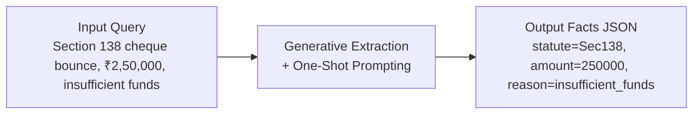
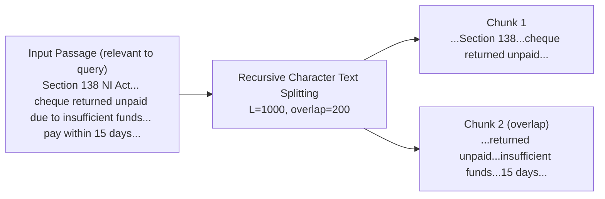
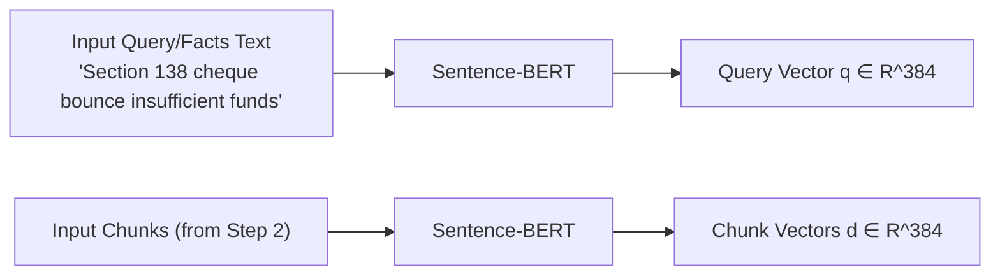
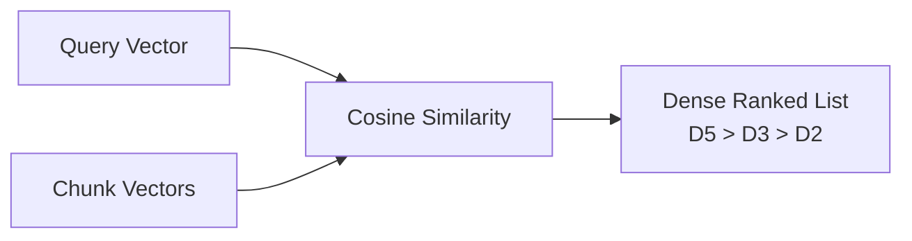
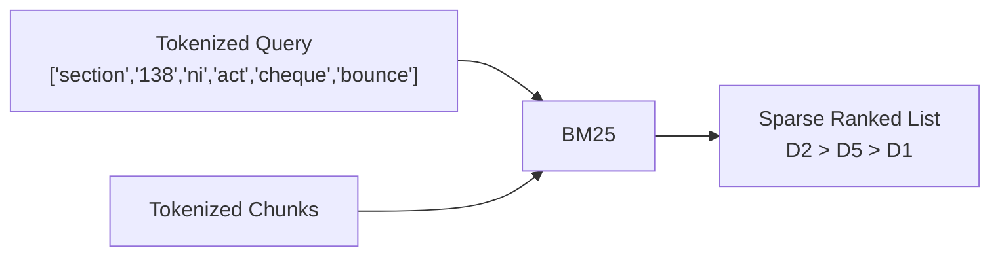
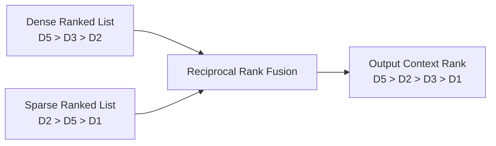
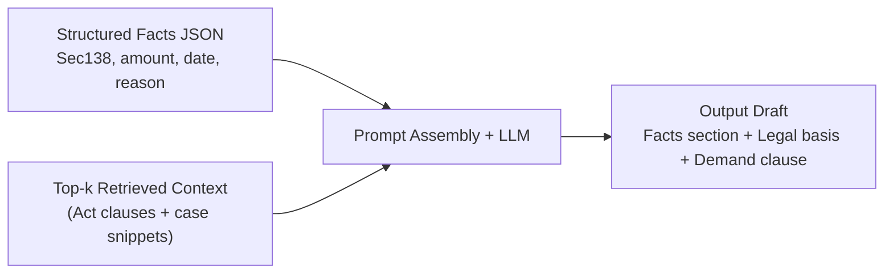
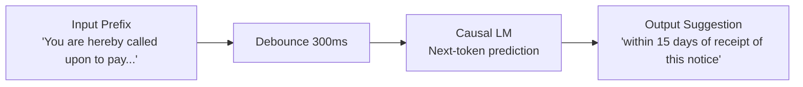

# 6. Implementation

## 6.1 Algorithms/Methods Used

The DroitDraft system leverages a combination of deterministic algorithms (for retrieval) and probabilistic methods (for generation) to solve the legal drafting challenge.

### 6.1.1 Retrieval-Augmented Generation (RAG)
We implemented a standard RAG pipeline to ground the AI's generation in verified legal data, preventing hallucinations.

*   **Chunking Methodology**: *Recursive Character Text Splitting*
    *   **Algorithm**: Documents are split into chunks of **1000 characters** with a **200-character overlap**.
    *   **Rationale**: Legal statutes often have cross-references. Overlap ensures that a sentence split across chunks doesn't lose context.
*   **Embedding Methodology**: *Dense Vector Mapping*
    *   **Model**: We use **Sentence-BERT (all-MiniLM-L6-v2)** to map legal text to a **384-dimensional dense vector space**.
    *   **Similarity Metric**: We use **Cosine Similarity** to calculate the angle between the Query Vector and Document Vectors. The chunks with the highest cosine similarity score (closest to 1.0) are retrieved as relevant context.

### 6.1.2 Hybrid Search (Keyword + Semantic)
To improve retrieval accuracy for specific legal terms (e.g., "Section 138"), we implement a Hybrid Search strategy.

*   **Dense Retrieval**: Uses Vector Similarity (captures semantic meaning like "bounced check").
*   **Sparse Retrieval**: Uses **BM25 (Best Matching 25)** algorithm (captures exact keywords like "NI Act").
*   **Fusion Algorithm**: **Reciprocal Rank Fusion (RRF)**. We rank the results from both methods and merge them based on the formula:
    $$ RRF(d) = \sum_{r \in R} \frac{1}{k + r(d)} $$
    where $r(d)$ is the rank of document $d$ in the retrieved list $R$, and $k$ is a constant (typically 60).

### 6.1.3 Fact Extraction (NER via Generative AI)
Instead of traditional CRF-based Named Entity Recognition (like Spacy), we use **Generative Extraction**.

*   **Method**: We pass the OCR text to Llama 3 with a strict **Pydantic/JSON Schema** definition.
*   **Prompting Strategy**: **One-Shot Prompting**. We provide *one* example of a correct extraction in the system prompt to guide the model's output format, ensuring the JSON structure is always valid.

### 6.1.4 Ghost Typing (Predictive Text)
*   **Method**: **Causal Language Modeling (Next Token Prediction)**. The model predicts the most probable next sequence of tokens based on the current cursor position.
*   **Optimization Algorithm**: **Debouncing**. To prevent server overload and UI jitter, the API request is only triggered after the user stops typing for **300ms**. If the user types again within this window, the previous request is cancelled.

## 6.2 Algorithm Walkthrough on One Example Query (Single Slide Narrative)

Goal: show how one user query is transformed step-by-step by the exact algorithms used in this project.

**Example query used across all steps**

> "Draft a legal notice under Section 138 NI Act for cheque bounce. Cheque amount is ₹2,50,000, cheque date is 05 Jan 2025, return memo reason is 'insufficient funds'."

### Step 1: Algorithm: Generative Extraction + One-Shot Prompting | Process: Fact Structuring

- Input query text is transformed into strict schema fields (statute, amount, cheque_date, dishonour_reason, task).
- One-shot prompting reduces format drift by making the model emit normalized legal keys instead of free prose.

### Step 2: Algorithm: Recursive Character Text Splitting | Process: Query-Relevant Passage Chunking

- Long legal text is transformed into overlapping chunks so query-critical terms survive split boundaries.
- For this query, phrases like "Section 138", "insufficient funds", and "15 days" remain retrievable across adjacent chunks.

**Equation / rule used**

$$ s_i = i \cdot (L - o),\; L=1000,\; o=200 $$

### Step 3: Algorithm: Sentence-BERT (all-MiniLM-L6-v2) | Process: Dense Vectorization

- Query/facts and chunks are transformed into vectors in the same 384-dimensional semantic space.
- This enables semantic matching even when exact legal wording differs.

### Step 4: Algorithm: Cosine Similarity | Process: Dense Retrieval Scoring

- Vector pairs $(\mathbf{q},\mathbf{d})$ are transformed into semantic similarity scores per chunk.
- Example behavior: a chunk containing "dishonoured cheque" can rank high for query phrase "cheque bounce".

**Equation used**

$$
\mathrm{cos\_sim}(\mathbf{q},\mathbf{d}) =
\frac{\mathbf{q} \cdot \mathbf{d}}{\|\mathbf{q}\|\,\|\mathbf{d}\|}
$$

### Step 5: Algorithm: BM25 | Process: Sparse Lexical Retrieval Scoring

- Token overlap and term statistics transform query/chunk tokens into lexical relevance scores.
- BM25 strongly boosts exact legal tokens such as "Section 138" and "NI Act".

**Equation used**

$$
\mathrm{BM25}(q,d)=\sum_{t\in q}\mathrm{IDF}(t)\cdot
\frac{f(t,d)(k_1+1)}{f(t,d)+k_1\left(1-b+b\frac{|d|}{\mathrm{avgdl}}\right)}
$$

### Step 6: Algorithm: Reciprocal Rank Fusion (RRF) | Process: Hybrid Rank Merge

- Dense and sparse ranked outputs are transformed into one fused ranking for robust retrieval.
- Documents strong in both channels rise to top context for generation.

**Equation used**

$$
\mathrm{RRF}(d)=\sum_{r\in R}\frac{1}{k+r(d)},\; k\approx 60
$$

### Step 7: Algorithm: Retrieval-Augmented Generation (RAG) | Process: Grounded Draft Synthesis

- Facts JSON and fused legal context are transformed into grounded notice sections.
- Prompt template: `Instructions + Facts JSON + Retrieved Context` to minimize unsupported claims.

### Step 8 (Optional): Algorithm: Causal Language Modeling + Debouncing | Process: Editor Suggestion Generation

- Partial draft text is transformed into next-token/next-phrase suggestions while the lawyer edits.
- Debouncing gates API calls so suggestions stay responsive without over-triggering requests.

**Equation used**

$$ P(x_t \mid x_{1:t-1}) = \mathrm{softmax}(z_t) $$

