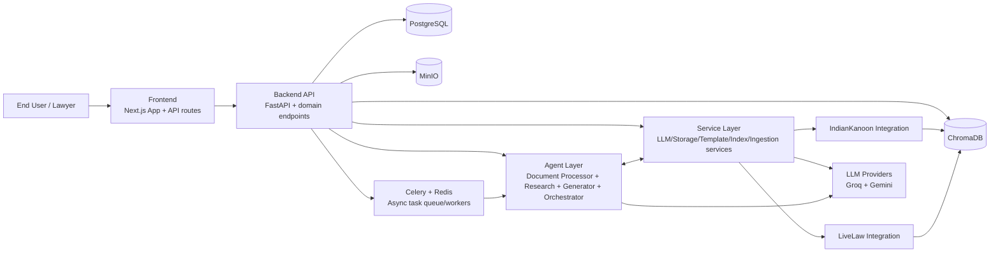
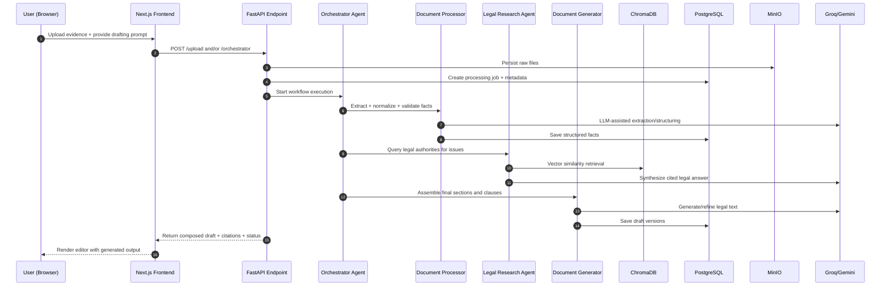
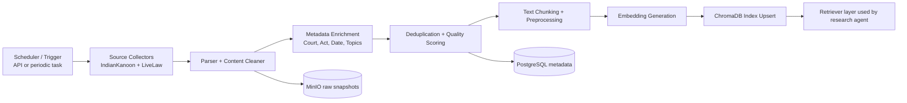

# System Architecture Diagram (Detailed)

This document provides a highly detailed architecture view of DroitDraft, including runtime request flow, asynchronous processing, and legal data ingestion/research pipelines.

## 1) Condensed System Block Diagram

## 2) End-to-End Platform Architecture

```mermaid
graph TB
    %% ======== Clients ========
    subgraph Clients[Client Layer]
        Browser[Lawyer Browser\nNext.js UI]
        APIClient[Programmatic Client\nREST consumer]
    end

    %% ======== Frontend ========
    subgraph Frontend[Frontend - Next.js 14]
        AppRoutes[App Router Pages\n/dashboard /editor /auth]
        UIComp[UI Components\nEditor, Document List, Modals]
        Hooks[Client Hooks\nuse-document, use-ghost-typing]
        NextAPI[Next API Routes\n/api/documents/search\n/api/documents/export]
        Actions[Server Actions\nfrontend/lib/actions.tsx]
    end

    %% ======== Backend API ========
    subgraph Backend[Backend - FastAPI]
        Main[app/main.py\nFastAPI bootstrap + middleware]
        V1Router[API v1 Router\napp/api/v1/api.py]

        subgraph Endpoints[Domain Endpoints]
            AuthEP[auth.py]
            UploadEP[upload.py]
            DocsEP[documents.py + documents_crud.py]
            TemplatesEP[templates.py]
            ResearchEP[research.py]
            CorpusEP[corpus.py]
            OrchestratorEP[orchestrator.py]
            LiveLawEP[livelaw.py]
        end

        Deps[Dependency Layer\napp/api/deps.py]
        Security[Security\nJWT + hashing\napp/core/security.py]
        Config[Settings\napp/core/config.py]
    end

    %% ======== Core Services ========
    subgraph Services[Application Services]
        LLMService[llm_service.py\nGroq primary + Gemini fallback]
        StorageSvc[storage.py\nMinIO/S3 interactions]
        TemplateSvc[template_service.py]
        Validator[document_validator.py]
        DocIndexer[document_indexer.py]
        EmbedGen[embedding_generator.py]
        CorpusIngest[corpus_ingestion.py]
        IngestMon[ingestion_monitor.py]
        TaskFacade[tasks.py\nservice-level async entrypoints]
    end

    %% ======== Agent Layer ========
    subgraph Agents[Agent Layer]
        subgraph DocProcessor[document_processor]
            TextExtractor[text_extractor.py]
            PDFProc[pdf_processor.py]
            OCRProc[ocr_processor.py]
            ImageProc[image_processor.py]
            NER[ner_engine.py]
            LLMExtract[llm_extractor.py]
            FactStruct[fact_structurer.py]
            FactValid[fact_validator.py]
            EntNorm[entity_normalizer.py]
            EntResolve[entity_resolver.py]
            EntValid[entity_validator.py]
            DocxProc[docx_processor.py]
        end

        subgraph LegalResearch[legal_research]
            ResearchAgent[agent.py]
            QueryAnalyzer[query_analyzer.py]
            Retrievers[retrievers.py]
            ResearchPipeline[pipeline.py]
            DocStore[document_store.py]
        end

        subgraph DocGenerator[document_generator]
            SectionGen[section_generator.py]
            FactMapper[fact_mapper.py]
            PromptTpl[prompt_templates.py]
            Assembly[assembly_engine.py]
            Consistency[consistency_checker.py]
            Formatter[document_formatter.py]
            OutputParser[output_parser.py]
            GhostTyping[ghost_typing.py]
            DGLLMClient[llm_client.py]
        end

        subgraph WorkflowOrch[orchestrator]
            WorkflowEngine[workflow_engine.py]
            AgentNodes[agent_nodes.py]
            WorkflowDefs[workflow_definitions/*.json]
            StateMgr[state_manager.py]
            ExecMon[execution_monitor.py]
            WorkflowBuilder[workflow_builder.py]
            GraphCfg[graph_config.py]
        end
    end

    %% ======== Integrations ========
    subgraph Integrations[External Legal Integrations]
        subgraph IndianKanoon[indian_kanoon integration]
            IKClient[client.py]
            IKQuery[query_builder.py]
            IKParser[response_parser.py]
            IKClean[content_cleaner.py]
            IKMeta[metadata_extractor.py]
            IKProcess[data_processor.py]
            IKDedup[deduplicator.py]
            IKStore[storage.py]
            IKRate[rate_limiter.py]
            IKCache[cache.py]
        end

        subgraph LiveLaw[livelaw integration]
            LLScraper[scraper.py]
            LLParser[parser.py]
            LLProcess[content_processor.py]
            LLEnrich[metadata_enricher.py]
            LLScore[quality_scorer.py]
            LLDedup[deduplicator.py]
            LLSchedule[scheduler.py]
            LLStore[storage.py]
        end
    end

    %% ======== Persistence ========
    subgraph Data[Persistence & Infrastructure]
        Postgres[(PostgreSQL\nusers/templates/docs/jobs)]
        Chroma[(ChromaDB\nvectors + semantic search)]
        MinIO[(MinIO S3\nuploaded/source files)]
        Redis[(Redis\nCelery broker/result)]
    end

    %% ======== Worker ========
    subgraph Async[Asynchronous Compute]
        CeleryApp[celery_app.py]
        Workers[Celery Workers\nlong-running processing]
    end

    %% ======== External LLM ========
    subgraph LLMProviders[LLM Providers]
        Groq[Groq API\nLlama family]
        Gemini[Google Gemini API\nfallback/provider]
    end

    %% ======== Flows ========
    Browser --> AppRoutes
    Browser --> UIComp
    AppRoutes --> Hooks
    Hooks --> Actions
    Browser --> NextAPI

    Actions --> Main
    NextAPI --> Main
    APIClient --> Main
    Main --> V1Router
    V1Router --> Endpoints

    Endpoints --> Deps
    Endpoints --> Security
    Endpoints --> Config

    Endpoints --> LLMService
    Endpoints --> StorageSvc
    Endpoints --> TemplateSvc
    Endpoints --> Validator
    Endpoints --> DocIndexer
    Endpoints --> EmbedGen
    Endpoints --> CorpusIngest
    Endpoints --> IngestMon
    Endpoints --> TaskFacade

    TaskFacade --> CeleryApp
    CeleryApp --> Redis
    Redis --> Workers

    Workers --> DocProcessor
    Workers --> LegalResearch
    Workers --> DocGenerator
    Workers --> WorkflowOrch

    Endpoints --> DocProcessor
    Endpoints --> LegalResearch
    Endpoints --> DocGenerator
    Endpoints --> WorkflowOrch

    DocProcessor --> MinIO
    DocProcessor --> Postgres

    LegalResearch --> Chroma
    LegalResearch --> Postgres

    DocGenerator --> Postgres

    WorkflowOrch --> Postgres
    WorkflowOrch --> Redis

    StorageSvc --> MinIO
    TemplateSvc --> Postgres
    DocIndexer --> Chroma
    EmbedGen --> Chroma
    CorpusIngest --> Chroma
    IngestMon --> Postgres

    CorpusIngest --> IndianKanoon
    CorpusIngest --> LiveLaw

    IndianKanoon --> Chroma
    IndianKanoon --> Postgres
    LiveLaw --> Chroma
    LiveLaw --> Postgres

    LLMService --> Groq
    LLMService --> Gemini
    DGLLMClient --> Groq
    DGLLMClient --> Gemini
    LLMExtract --> Groq
    LLMExtract --> Gemini
    GhostTyping --> Groq
```

## 3) Primary Runtime Sequence (Drafting + Research)

## 4) Ingestion & Indexing Pipeline (Legal Corpus)

## 5) Notes

- The architecture intentionally separates synchronous API paths from long-running and compute-heavy tasks via Celery/Redis workers.
- The legal-research subsystem is coupled to ChromaDB for retrieval, while relational records and workflow state are persisted in PostgreSQL.
- LLM access is centralized in backend services and agent-specific clients to support provider fallback and feature-specific prompting.
