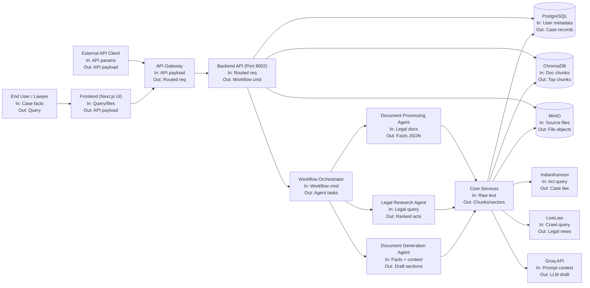
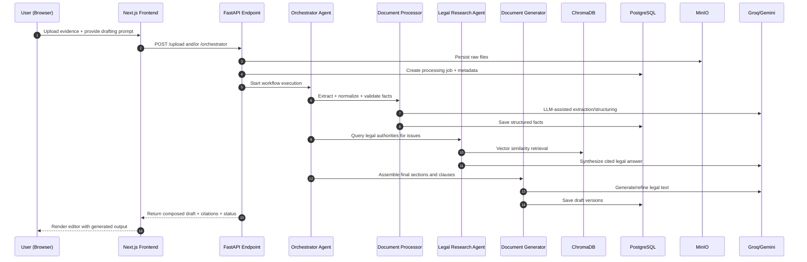
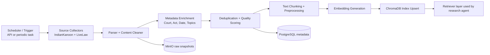

# System Architecture Diagram (Detailed)

This document provides a highly detailed architecture view of DroitDraft, including runtime request flow, asynchronous processing, and legal data ingestion/research pipelines.

## 1) Structured System Block Diagram (PPT-Oriented)

```mermaid
flowchart LR
    User["End User / Lawyer\nIn: Case facts\nOut: Query"] --> FE["Frontend (Next.js UI)\nIn: Query/files\nOut: API payload"]
    APIClient["External API Client\nIn: API params\nOut: API payload"] --> GW

    FE --> GW["API Gateway\nIn: API payload\nOut: Routed req"]
    GW --> BE["Backend API (Port 8002)\nIn: Routed req\nOut: Workflow cmd"]

    BE --> Orch["Workflow Orchestrator\nIn: Workflow cmd\nOut: Agent tasks"]
    Orch --> DocProc["Document Processing Agent\nIn: Legal docs\nOut: Facts JSON"]
    Orch --> LegalRes["Legal Research Agent\nIn: Legal query\nOut: Ranked acts"]
    Orch --> DocGen["Document Generation Agent\nIn: Facts + context\nOut: Draft sections"]

    DocProc --> Services["Core Services\nIn: Raw text\nOut: Chunks/vectors"]
    LegalRes --> Services
    DocGen --> Services

    %% Backend-mediated storage access only
    BE --> PG[("PostgreSQL\nIn: User metadata\nOut: Case records")]
    BE --> CH[("ChromaDB\nIn: Doc chunks\nOut: Top chunks")]
    BE --> MO[("MinIO\nIn: Source files\nOut: File objects")]
    Services --> PG
    Services --> CH
    Services --> MO

    Services --> IK["IndianKanoon\nIn: Act query\nOut: Case law"]
    Services --> LL["LiveLaw\nIn: Crawl query\nOut: Legal news"]
    Services --> Groq["Groq API\nIn: Prompt context\nOut: LLM draft"]
```

### 1.1 Interaction Explanation

- **User/API ingress**: Lawyers use the frontend UI, while automation can call backend endpoints directly via REST.
- **Frontend-to-backend flow**: Frontend pages and Next API routes/server actions both invoke FastAPI endpoints for auth, upload, research, and document operations.
- **Backend coordination**: FastAPI endpoints delegate orchestration to the workflow engine and feature-specific responsibilities to core services.
- **Orchestration and agent execution**: The orchestrator sequences document-processing, legal-research, and document-generation agents, including state transitions and dependency ordering.
- **Service-agent collaboration**: Agents and core services interact bidirectionally for shared capabilities (LLM calls, storage access, indexing, validation, and template handling).
- **Processing execution path**: Requests are routed through orchestrator-managed agent steps; shared services persist and retrieve state/artifacts for each step.
- **Persistence interactions**:
  - PostgreSQL stores transactional/stateful records (users, templates, jobs, metadata, draft states).
  - ChromaDB stores embeddings and retrieval indexes used by research and drafting assistance.
  - MinIO stores uploaded evidence and raw/processed artifacts.
- **External legal data ingestion**: Ingestion services call IndianKanoon and LiveLaw sources, then normalize, deduplicate, and route usable content into platform stores.
- **LLM provider interaction**: Services and agent modules invoke Groq for drafting, extraction, and synthesis tasks.

## 2) End-to-End Platform Architecture

```mermaid
graph TB
    %% ======== Clients ========
    subgraph Clients[Client Layer]
        Browser[Lawyer Browser\nNext.js UI]
        APIClient[Programmatic Client\nREST consumer]
    end

    %% ======== Frontend ========
    subgraph Frontend[Frontend - Next.js 14]
        AppRoutes[App Router Pages\n/dashboard /editor /auth]
        UIComp[UI Components\nEditor, Document List, Modals]
        Hooks[Client Hooks\nuse-document, use-ghost-typing]
        NextAPI[Next API Routes\n/api/documents/search\n/api/documents/export]
        Actions[Server Actions\nfrontend/lib/actions.tsx]
    end

    %% ======== Backend API ========
    subgraph Backend[Backend - FastAPI]
        Main[app/main.py\nFastAPI bootstrap + middleware]
        V1Router[API v1 Router\napp/api/v1/api.py]

        subgraph Endpoints[Domain Endpoints]
            AuthEP[auth.py]
            UploadEP[upload.py]
            DocsEP[documents.py + documents_crud.py]
            TemplatesEP[templates.py]
            ResearchEP[research.py]
            OrchestratorEP[orchestrator.py]
        end

        Deps[Dependency Layer\napp/api/deps.py]
        Security[Security\nJWT + hashing\napp/core/security.py]
        Config[Settings\napp/core/config.py]
    end

    %% ======== Core Services ========
    subgraph Services[Application Services]
        LLMService[llm_service.py\nGroq primary + Gemini fallback]
        StorageSvc[storage.py\nMinIO/S3 interactions]
        TemplateSvc[template_service.py]
        Validator[document_validator.py]
        DocIndexer[document_indexer.py]
        EmbedGen[embedding_generator.py]
        CorpusIngest[corpus_ingestion.py]
        IngestMon[ingestion_monitor.py]
        TaskFacade[tasks.py\nservice-level async entrypoints]
    end

    %% ======== Agent Layer ========
    subgraph Agents[Agent Layer]
        subgraph DocProcessor[document_processor]
            TextExtractor[text_extractor.py]
            PDFProc[pdf_processor.py]
            OCRProc[ocr_processor.py]
            ImageProc[image_processor.py]
            NER[ner_engine.py]
            LLMExtract[llm_extractor.py]
            FactStruct[fact_structurer.py]
            FactValid[fact_validator.py]
            EntNorm[entity_normalizer.py]
            EntResolve[entity_resolver.py]
            EntValid[entity_validator.py]
            DocxProc[docx_processor.py]
        end

        subgraph LegalResearch[legal_research]
            ResearchAgent[agent.py]
            QueryAnalyzer[query_analyzer.py]
            Retrievers[retrievers.py]
            ResearchPipeline[pipeline.py]
            DocStore[document_store.py]
        end

        subgraph DocGenerator[document_generator]
            SectionGen[section_generator.py]
            FactMapper[fact_mapper.py]
            PromptTpl[prompt_templates.py]
            Assembly[assembly_engine.py]
            Consistency[consistency_checker.py]
            Formatter[document_formatter.py]
            OutputParser[output_parser.py]
            GhostTyping[ghost_typing.py]
            DGLLMClient[llm_client.py]
        end

        subgraph WorkflowOrch[orchestrator]
            WorkflowEngine[workflow_engine.py]
            AgentNodes[agent_nodes.py]
            WorkflowDefs[workflow_definitions/*.json]
            StateMgr[state_manager.py]
            ExecMon[execution_monitor.py]
        end
    end

    %% ======== Integrations ========
    subgraph Integrations[External Legal Integrations]
        subgraph IndianKanoon[indian_kanoon integration]
            IKClient[client.py]
            IKQuery[query_builder.py]
            IKParser[response_parser.py]
            IKClean[content_cleaner.py]
            IKMeta[metadata_extractor.py]
            IKProcess[data_processor.py]
            IKDedup[deduplicator.py]
            IKStore[storage.py]
            IKRate[rate_limiter.py]
            IKCache[cache.py]
        end

        subgraph LiveLaw[livelaw integration]
            LLScraper[scraper.py]
            LLParser[parser.py]
            LLProcess[content_processor.py]
            LLEnrich[metadata_enricher.py]
            LLScore[quality_scorer.py]
            LLDedup[deduplicator.py]
            LLSchedule[scheduler.py]
            LLStore[storage.py]
        end
    end

    %% ======== Persistence ========
    subgraph Data[Persistence & Infrastructure]
        Postgres[(PostgreSQL\nusers/templates/docs/jobs)]
        Chroma[(ChromaDB\nvectors + semantic search)]
        MinIO[(MinIO S3\nuploaded/source files)]
        Redis[(Redis\nCelery broker/result)]
    end

    %% ======== Worker ========
    subgraph Async[Asynchronous Compute]
        CeleryApp[celery_app.py]
        Workers[Celery Workers\nlong-running processing]
    end

    %% ======== External LLM ========
    subgraph LLMProviders[LLM Providers]
        Groq[Groq API\nLlama family]
        Gemini[Google Gemini API\nfallback/provider]
    end

    %% ======== Flows ========
    Browser --> AppRoutes
    Browser --> UIComp
    AppRoutes --> Hooks
    Hooks --> Actions
    Browser --> NextAPI

    Actions --> Main
    NextAPI --> Main
    APIClient --> Main
    Main --> V1Router
    V1Router --> Endpoints

    Endpoints --> Deps
    Endpoints --> Security
    Endpoints --> Config

    Endpoints --> LLMService
    Endpoints --> StorageSvc
    Endpoints --> TemplateSvc
    Endpoints --> Validator
    Endpoints --> DocIndexer
    Endpoints --> EmbedGen
    Endpoints --> CorpusIngest
    Endpoints --> IngestMon
    Endpoints --> TaskFacade

    TaskFacade --> CeleryApp
    CeleryApp --> Redis
    Redis --> Workers

    Workers --> DocProcessor
    Workers --> LegalResearch
    Workers --> DocGenerator
    Workers --> WorkflowOrch

    Endpoints --> DocProcessor
    Endpoints --> LegalResearch
    Endpoints --> DocGenerator
    Endpoints --> WorkflowOrch

    DocProcessor --> MinIO
    DocProcessor --> Postgres

    LegalResearch --> Chroma
    LegalResearch --> Postgres

    DocGenerator --> Postgres

    WorkflowOrch --> Postgres
    WorkflowOrch --> Redis

    StorageSvc --> MinIO
    TemplateSvc --> Postgres
    DocIndexer --> Chroma
    EmbedGen --> Chroma
    CorpusIngest --> Chroma
    IngestMon --> Postgres

    CorpusIngest --> IndianKanoon
    CorpusIngest --> LiveLaw

    IndianKanoon --> Chroma
    IndianKanoon --> Postgres
    LiveLaw --> Chroma
    LiveLaw --> Postgres

    LLMService --> Groq
    LLMService --> Gemini
    DGLLMClient --> Groq
    DGLLMClient --> Gemini
    LLMExtract --> Groq
    LLMExtract --> Gemini
    GhostTyping --> Groq
```

## 3) Primary Runtime Sequence (Drafting + Research)

```mermaid
sequenceDiagram
    autonumber
    participant U as User (Browser)
    participant FE as Next.js Frontend
    participant BE as FastAPI Endpoint
    participant OR as Orchestrator Agent
    participant DP as Document Processor
    participant RG as Legal Research Agent
    participant DG as Document Generator
    participant VS as ChromaDB
    participant DB as PostgreSQL
    participant OBJ as MinIO
    participant LLM as Groq/Gemini

    U->>FE: Upload evidence + provide drafting prompt
    FE->>BE: POST /upload and/or /orchestrator
    BE->>OBJ: Persist raw files
    BE->>DB: Create processing job + metadata
    BE->>OR: Start workflow execution

    OR->>DP: Extract + normalize + validate facts
    DP->>LLM: LLM-assisted extraction/structuring
    DP->>DB: Save structured facts

    OR->>RG: Query legal authorities for issues
    RG->>VS: Vector similarity retrieval
    RG->>LLM: Synthesize cited legal answer

    OR->>DG: Assemble final sections and clauses
    DG->>LLM: Generate/refine legal text
    DG->>DB: Save draft versions

    BE-->>FE: Return composed draft + citations + status
    FE-->>U: Render editor with generated output
```

## 4) Ingestion & Indexing Pipeline (Legal Corpus)

```mermaid
flowchart LR
    SCHED[Scheduler / Trigger\nAPI or periodic task] --> SRC[Source Collectors\nIndianKanoon + LiveLaw]
    SRC --> PARSE[Parser + Content Cleaner]
    PARSE --> ENRICH[Metadata Enrichment\nCourt, Act, Date, Topics]
    ENRICH --> DEDUP[Deduplication + Quality Scoring]
    DEDUP --> CHUNK[Text Chunking + Preprocessing]
    CHUNK --> EMBED[Embedding Generation]
    EMBED --> INDEX[ChromaDB Index Upsert]
    DEDUP --> META[(PostgreSQL metadata)]
    PARSE --> RAW[(MinIO raw snapshots)]
    INDEX --> RETRIEVE[Retriever layer used by research agent]
```

## 5) Notes

- The architecture intentionally separates synchronous API paths from long-running and compute-heavy tasks via Celery/Redis workers.
- The `WorkflowEngine` is the modern canonical entry point for multi-agent legal processes, replacing legacy graph builders.
- The legal-research subsystem is coupled to ChromaDB for retrieval, while relational records and workflow state are persisted in PostgreSQL.
- LLM access is centralized in backend services and agent-specific clients to support provider fallback and feature-specific prompting.
